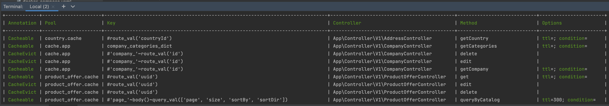

# A set of Symfony controller cache annotations

| Annotation  | Description                                                                                                                                                                                                                  |
|-------------|------------------------------------------------------------------------------------------------------------------------------------------------------------------------------------------------------------------------------|
| @Cacheable  | If a key exists in the cache pool and it is not expired returns a cached value instead of a controller action invocation. Otherwise passes to a controller action and puts into the cache pool the result of the invocation. |
| @CacheEvict | Removes a cached value from a cache pool.                                                                                                                                                                                    |

## Install

`composer require paveldanilin/response-cache-bundle`


## Configuration

```yaml
# Default values
response_cache:
  lock:
    factory: 'lock.response_cache.factory'
  controller:
    dir: '%kernel.project_dir%/src'
```

`lock.factory`: A lock factory service, [read more](https://symfony.com/doc/current/components/lock.html) about lock component configuration.

`controller.dir`: A controller directory for annotation scan.

## Usage

### @Cacheable
Enables caching behavior for a controller action method.

```php
@Cacheable(
    pool="<cache.pool.name>",
    key="<item.key.name>",
    ttl="<expires.after.sec>",
    condition="<request.condition.expression>"
)
```

The default parameters:
- `key` - a concatenated class name with a method name: `App\Controller\MyController_doHeavyComputation`
- `pool` - `cache.app`
- `ttl` - null (never gets expired)
- `condition` - null

```php
/**
  * @Cacheable()
  * @Route("/api/v1/work", methods={"GET"}, name="do.work")
  * @return JsonResponse
  */
public function doWork(Request $request): JsonResponse
{
    $data = doHeavyComputations();
    return new JsonResponse($data);
}
```

#### Key
There are two types of keys:
- static
- dynamic


**Static key**

The static key is whether an empty value `<className_methodName>` or a string `'<static_key>'`.

For example: `@Cacheable()` or `@Cacheable(key='my_item')`


**Dynamic key**

The dynamic key starts from the '#' sign i.e. `#<expression>`.

[Symfony expression language](https://symfony.com/doc/current/components/expression_language/syntax.html) is used for the dynamic key computation.

The following variables and functions can be used in the expression:

| Variable       | Description                | Type                                      |
|----------------|----------------------------|-------------------------------------------|
| request        | Inbound request object     | \Symfony\Component\HttpFoundation\Request |                   |
 | request_method | Http request method        | string                                    |
 | request_uri    | Request URI                | string                                    |
 | request_locale | Request Locale             | string                                    |


| Function                  | Description                                                |
|---------------------------|------------------------------------------------------------|
| query_val(key, def = '')  | * *key* string or array of strings<br/>  * *def* string    |
| route_val(key, def = '')  | * *key* string or array of strings<br/>  * *def* string    |
| body()                    | Returns a request body content                             |
| body_json(path, def = '') | Decodes a request body as json and returns the path value. |

Examples:

```php
@Cacheable(key="#request.getMethod()~request.getRequestUri()")
```

```php
@Cacheable(key="#query_val('id', 'def_value')")
```

```php
@Cacheable(key="#query_val(['id', 'x_query_param'])")
```

```php
@Cacheable(key="#route_val('id')")
```

```php
@Cacheable(key="#route_val(['id', 'x_route_param'])")
```

```php
// Request body: {"account": {"id": 123}}
@Cacheable(key="#body_json('account.id')")
```

#### Pool

You can [define](https://symfony.com/doc/current/cache.html) your own cache pool and use it instead of the default `cache.app`.
Keep in mind that the cache pool must be defined as public.

#### TTL

Time to live of the cache item in seconds.
If not defined will be used a pool default value.


#### Condition

If we want more control over when the annotation is active, we can parameterize @Cacheable with a condition parameter that
takes a Symfony expression and ensures that the results are cached based on evaluating that expression.


### @CacheEvict
`@CacheEvict(pool=<cache.pool.name>, key=<item.key.name>)`


## Console command
- `php ./bin/console debug:response-cache`

